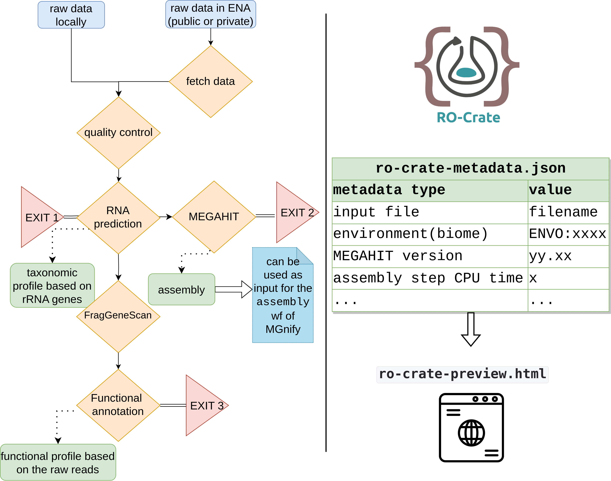
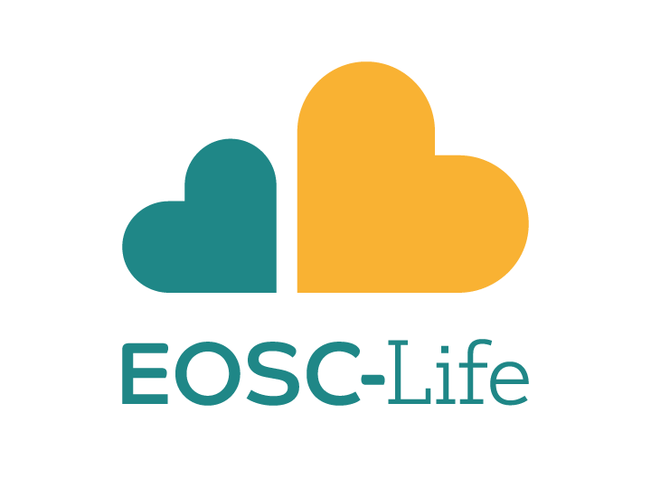
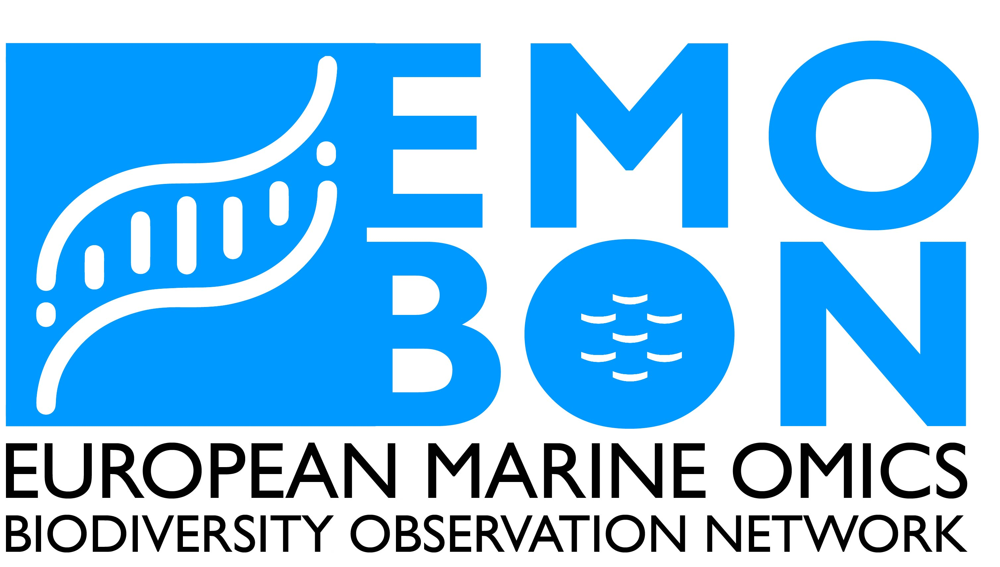

Welcome to metaGOflow's documentation!
===================================

**metaGOflow** is a 
`Common Workflow Language (CWL) <https://commonwl.org>`_
based pipeline
for the analysis of shotgun metagenomic data at the sample level.
It was initially built to address the needs of the 
`EMO BON community <https://www.embrc.eu/services/emo-bon>`_
but it can be used for any type of shotgun sequencing data.
``metaGOflow`` is based on the tools and subworkflow implemented in the 
framework of `MGnify <https://github.com/EBI-Metagenomics/pipeline-v5>`_.

It produces a `Research Object Crate (RO-Crate) <https://www.researchobject.org/ro-crate/>`_
as its main output that includes the taxonomic inventory and/or the functional profile of the sample
based on the user's settings. 

Check out the :doc:`usage` section for further information, including
:ref:`installation` instructions for the project.

.. note::

   If you find metaGOflow useful, remember to cite it:
   Haris Zafeiropoulos, Martin Beracochea, Stelios Ninidakis, Katrina Exter, Antonis Potirakis, Gianluca De Moro, Lorna Richardson, Erwan Corre, 
   João Machado, Evangelos Pafilis, Georgios Kotoulas, Ioulia Santi, Robert D Finn, Cymon J Cox, Christina Pavloudi, metaGOflow: a workflow for the analysis of marine Genomic Observatories shotgun metagenomics data, *GigaScience*, Volume 12, 2023, giad078, `10.1093/gigascience/giad078 <https://academic.oup.com/gigascience/article/doi/10.1093/gigascience/giad078/7321054>`_.

Contents
--------

.. toctree::

   installation
   args_and_params
   usage
   data_products
   faq

